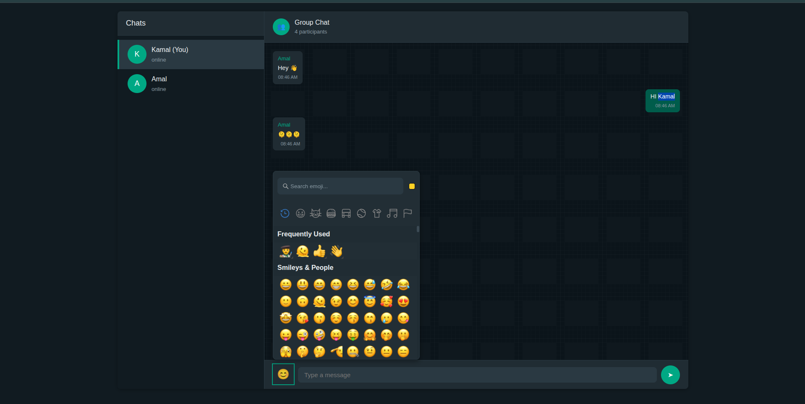

# 💬 Real-Time Chat Application

A real-time chat application built with React, TypeScript, Node.js, Express, and Socket.IO.

## Preview



## Features

✨ **Real-time messaging** - Instant message delivery using WebSockets
👥 **User presence** - See who's online in the chat room
⌨️ **Typing indicators** - Know when someone is typing
🎨 **Modern UI** - Clean and intuitive user interface
📱 **Responsive design** - Works on desktop and mobile devices

## Tech Stack

### Frontend

- React 18
- TypeScript
- Socket.IO Client
- Vite

### Backend

- Node.js
- Express
- Socket.IO Server
- TypeScript

## Getting Started

### Prerequisites

- Node.js (v16 or higher)
- npm or yarn

### Installation

1. **Clone the repository**

   ```bash
   git clone <https://github.com/amliyanage/Live-Chat-Application-Using-React-And-Node.git>
   cd collaborative-editor
   ```

2. **Install backend dependencies**

   ```bash
   cd backend
   npm install
   ```

3. **Install frontend dependencies**
   ```bash
   cd ../frontend
   npm install
   ```

### Running the Application

1. **Start the backend server**

   ```bash
   cd backend
   npm run dev
   ```

   The server will start on `http://localhost:3000`

2. **Start the frontend development server** (in a new terminal)

   ```bash
   cd frontend
   npm run dev
   ```

   The app will open on `http://localhost:5173`

3. **Open multiple browser tabs** to test real-time messaging between different users

## Usage

1. Enter your username when prompted
2. Click "Join Chat" to enter the chat room
3. Type messages in the input field and press "Send" or hit Enter
4. See other users online in the sidebar
5. Watch typing indicators appear when others are typing

## Project Structure

```
collaborative-editor/
├── backend/
│   ├── src/
│   │   ├── server.ts      # Socket.IO server setup
│   │   └── types.ts       # TypeScript type definitions
│   ├── package.json
│   └── tsconfig.json
│
├── frontend/
│   ├── src/
│   │   ├── App.tsx        # Main app component with login
│   │   ├── ChatRoom.tsx   # Chat room component
│   │   ├── types.ts       # TypeScript type definitions
│   │   ├── App.css        # Styles
│   │   └── main.tsx       # App entry point
│   ├── package.json
│   └── vite.config.ts
│
└── README.md
```

## Socket.IO Events

### Client to Server

- `join-room` - Join a chat room with username
- `send-message` - Send a message to the room
- `typing` - Notify others that user is typing
- `stop-typing` - Notify others that user stopped typing

### Server to Client

- `message-received` - Receive a new message
- `user-joined` - Notified when a user joins
- `user-left` - Notified when a user leaves
- `user-typing` - Notified when a user is typing
- `user-stop-typing` - Notified when a user stops typing

## Features to Add

- [ ] Multiple chat rooms
- [ ] Private messaging
- [ ] Message history persistence (database)
- [ ] User authentication
- [ ] File/image sharing
- [ ] Emoji support
- [ ] Message reactions
- [ ] Dark mode
- [ ] Message search
- [ ] User profiles

## License

MIT

## Contributing

Pull requests are welcome! For major changes, please open an issue first to discuss what you would like to change.
